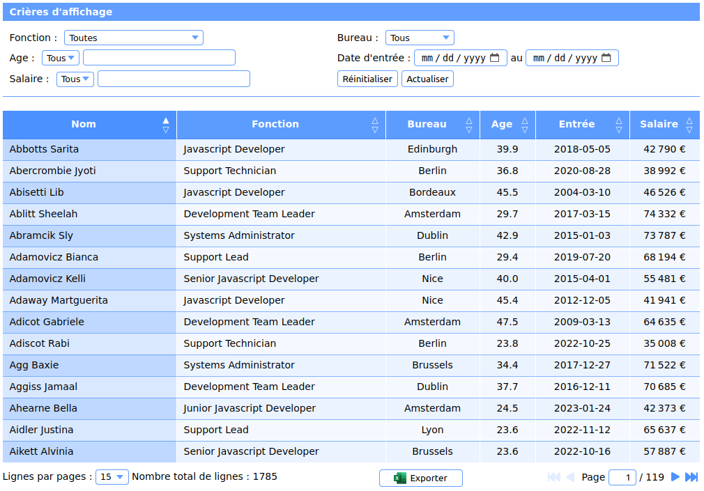

## Project purpose

Build a back-end and a front-end to display a table of (fake) employees.
The filtering, sorting and paging of the data will be done by the back-end.

Employees schema is :

```typescript
{
  id: string;
  gender: string;
  firstName: string;
  lastName: string;
  birthDate: number;
  startDate: number;
  country: string;
  office: string;
  department: string;
  jobTitle: string;
  salary: number;
}
```

The employee database is built from a file containing data in `csv` format.

## Back-end

The back-end is built with Fastifiy and exposes 3 endpoints:

- `/api/v1/employeesFilterProps`:  
  Returns all `countries`, `offices`, `departments`, `jobTitles` to fill the filters options in the front-end

- `/api/v1/employees`:

  Params (as query string) are:

  - `ordereBy`: **fullName**, birthDate, startDate, office, jobTitle, salary
  - `sortMode`: **asc**, desc
  - `page`: 1, ...
  - `limit`: 15, ...
  - `filters`: JSON array of filter `{ key, value?, from?, to? }`

Returns an array of `employees` objects according to the query parameters

- `/api/v1/employees/export`:

Params: (same as `/api/v1/employees`)

Return an Excel file buffer according to the query parameters

## Front-end

The interface is composed of a filtering form and a table of results.


